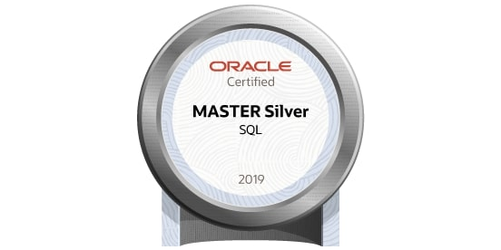
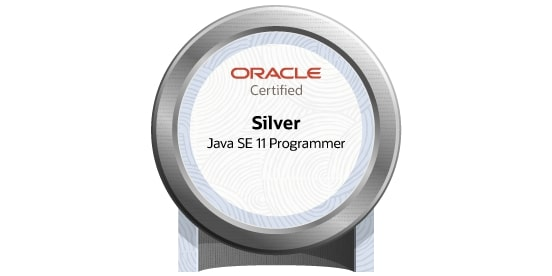
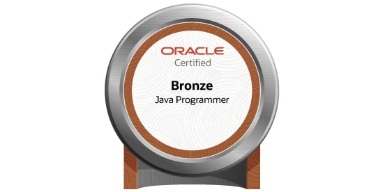

## Hello👋

1998年生まれ、新潟で育ち現在は東京にいます。

簡単なプログラムや日記を書いて草を生やしています。

**苦手なことは環境構築です。**

知識は狭く、浅く

***

##  skills💻

### Java　<i class="fab fa-java" style="font-size:1.2em;"></i>

大学2年間の講義を受けていましたがほぼ書けないです。Springとか触ってみたいです。

### C　<i class="fas fa-copyright" style="font-size:1.2em;"></i>

大学1年間の講義を受けていましたがかなり書けないです。ポインタやメモリの部分で挫折しました。

### Ruby　<i class="fas fa-gem" style="font-size:1.0em;"></i>

独学で書いています。[AtCoder](https://atcoder.jp/?lang=ja)で使っています。レートは灰です。RailsやJekyllで使いました。

### PHP　<i class="fab fa-php" style="font-size:1.2em;"></i>

卒業研究でLINEBotを作った際に使用しました。その際はフレームワークであるLaravelを使用しました。[PHP マニュアル](https://www.php.net/manual/ja/index.php)と[クエリビルダ](https://readouble.com/laravel/8.x/ja/queries.html)にはお世話になりました。

### Vue.js　<i class="fab fa-vuejs" style="font-size:1.2em;"></i>

業務で書いてます。勉強中です。

### JavaScript/TypeScript　<i class="fab fa-js" style="font-size:1.2em;"></i>

業務で書いてます。勉強中です。

***

##  certification🧪

### 2023/03/21 1Z0-071 Oracle Database SQL <svg xmlns="http://www.w3.org/2000/svg" height="1.2em" viewBox="0 0 448 512"><!--! Font Awesome Free 6.4.0 by @fontawesome - https://fontawesome.com License - https://fontawesome.com/license (Commercial License) Copyright 2023 Fonticons, Inc. --><path d="M448 80v48c0 44.2-100.3 80-224 80S0 172.2 0 128V80C0 35.8 100.3 0 224 0S448 35.8 448 80zM393.2 214.7c20.8-7.4 39.9-16.9 54.8-28.6V288c0 44.2-100.3 80-224 80S0 332.2 0 288V186.1c14.9 11.8 34 21.2 54.8 28.6C99.7 230.7 159.5 240 224 240s124.3-9.3 169.2-25.3zM0 346.1c14.9 11.8 34 21.2 54.8 28.6C99.7 390.7 159.5 400 224 400s124.3-9.3 169.2-25.3c20.8-7.4 39.9-16.9 54.8-28.6V432c0 44.2-100.3 80-224 80S0 476.2 0 432V346.1z"/></svg>

rate/border(%)

65/63

### 2022/09/24 1Z0-815 Java SE 11 Programmer I <i class="fab fa-java" style="font-size:1.2em;"></i>

rate/border(%)

70/63

### 2022/03/12 1Z0-818 Java SE Bronze <i class="fab fa-java" style="font-size:1.2em;"></i>

rate/border(%)
80/60

### 2022/03/12 1Z0-818 Java SE Bronze <i class="fab fa-java" style="font-size:1.2em;"></i>

rate/border(%)
80/60

***

## contact🤝

- [twitter](https://twitter.com/creepy_cats){:target="_blank"}

***

## finally🐉

**WE GOTTA POWER!!🔥🔥🔥**

 

